# 中国的5G发展现状

* 政府
  * 概述
    * 国家创新战略重点
      * 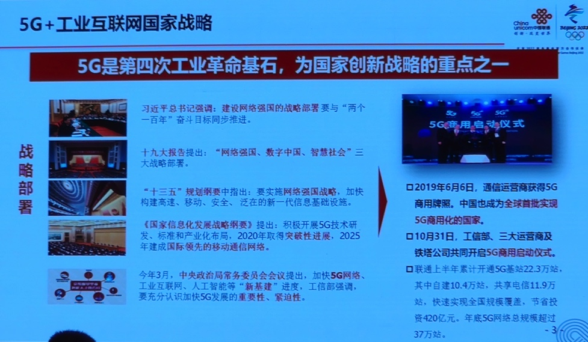
    * 5G+工业互联网 512工程
      * 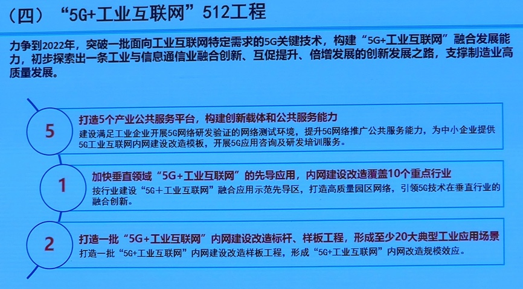
    * 推进跨界融合创新和打造产业支撑体系
      * 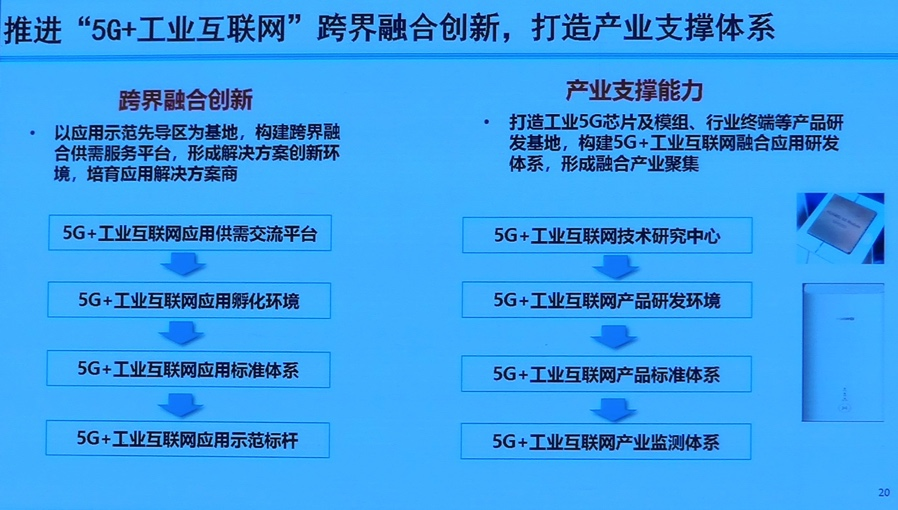
  * 时间节点
    * 2019年6月
      * 中国`5G`商用
        * 之前预计2020年商用
          * * 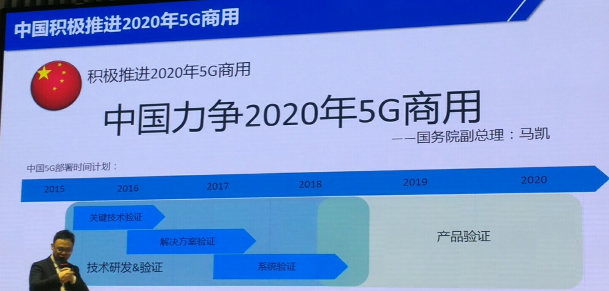
    * 2019年10月31日
      * 工信部 三大运营商 5G商用启动仪式
* 地方
  * 概述
    * 各地政府积极建设5G
      * 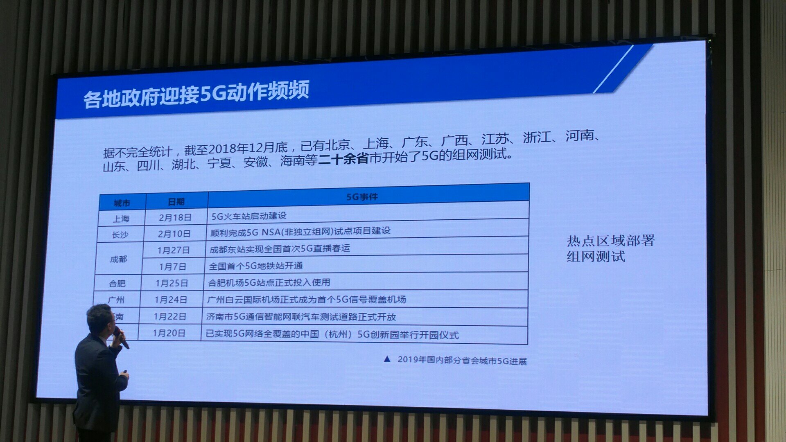
  * 北京
    * 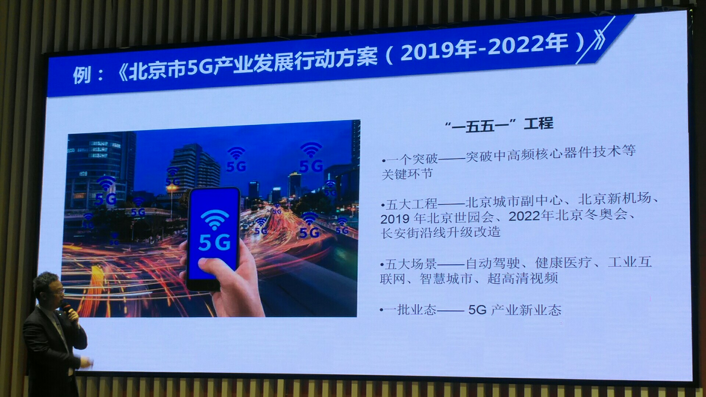
  * 其他城市试点
    * 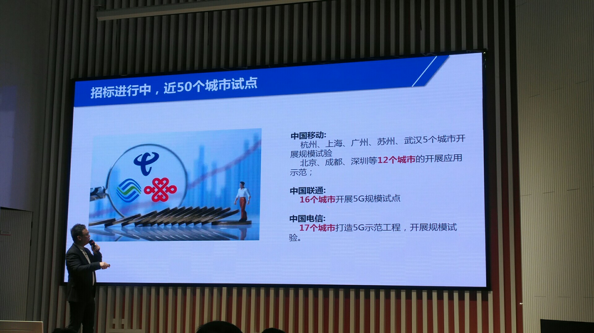
* 运营商
  * 中国联通
    * 概述
      * 5G基站个数
        * 2020年上半年  22.3万
          * 自建：10.4万
          * 共享电信：11.9万
        * 2020年年底
          * 37万个
    * 5G产品方案
      * 服务产品体系
        * 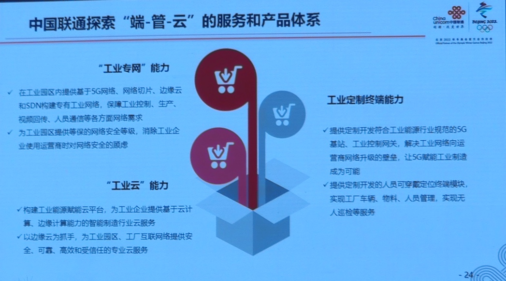
      * 5Gn View工业智能辅助系统
        * 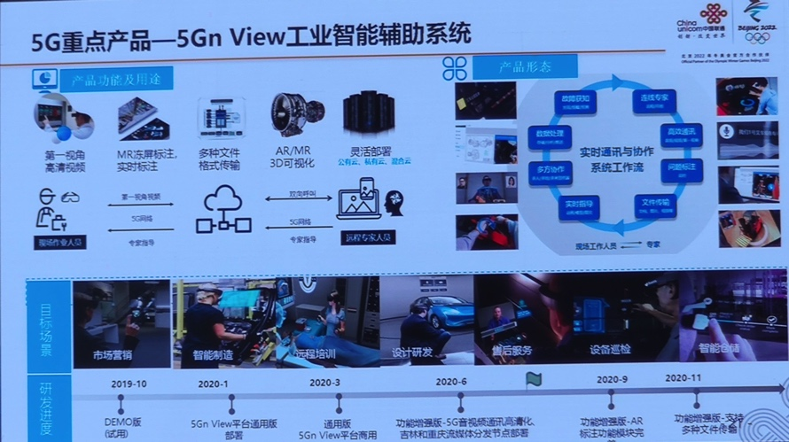
      * 5G沃智控节能管理系统
        * 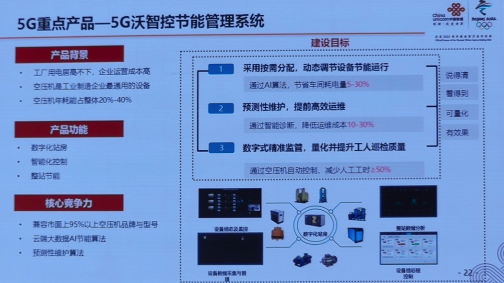
      * 5G云化智能网关
        * 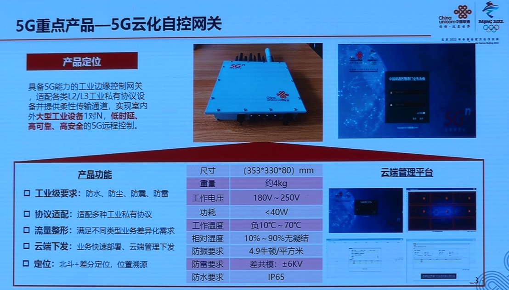
* 企业
  * 互联网和终端企业积极参与5G
    * 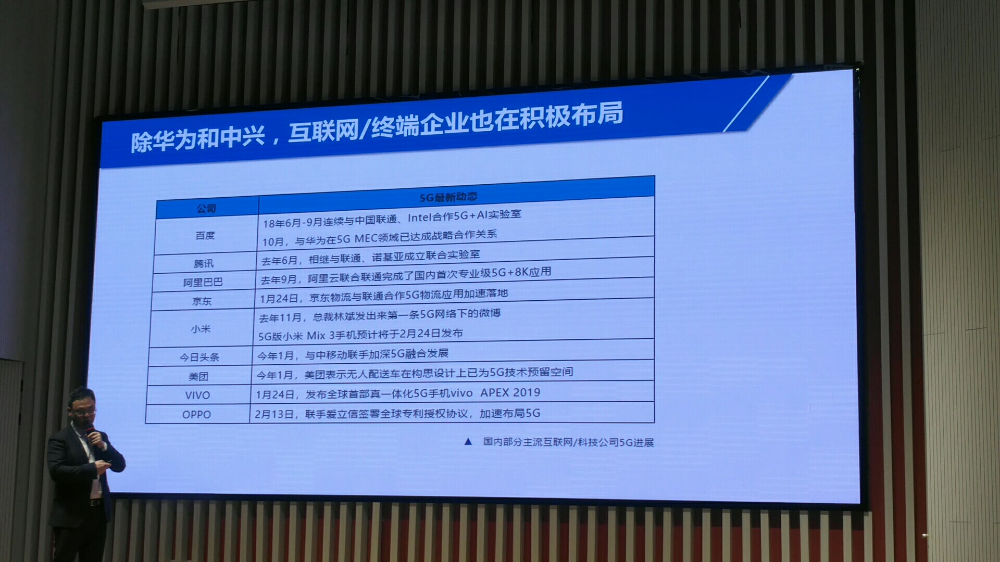
* 其他相关
  * 美国封杀华为5G
    * 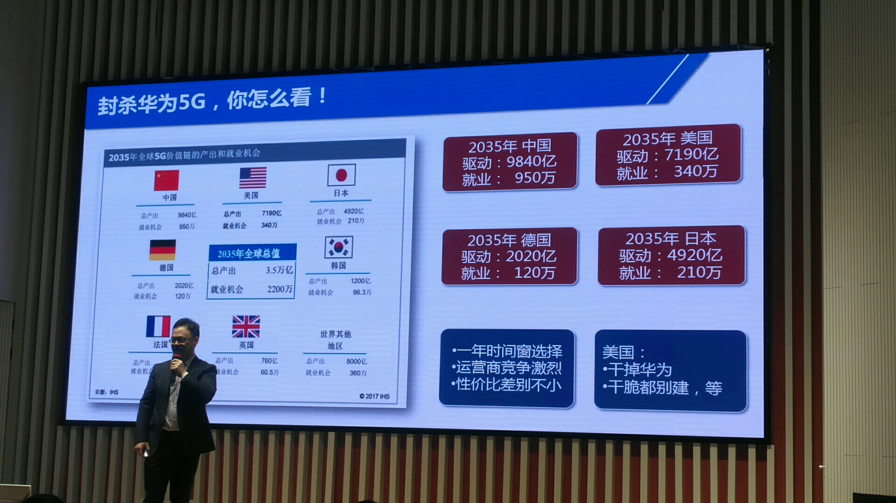
