# 苏州的5G发展现状

## 苏州工业园区

* 5G+工业互联网
  * 服务企业和融合应用 案例集
    * 封面
      * 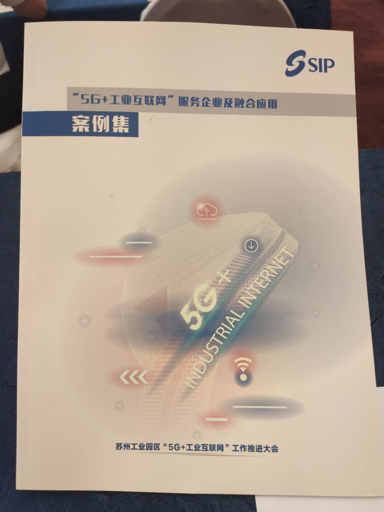
    * 目录
      * 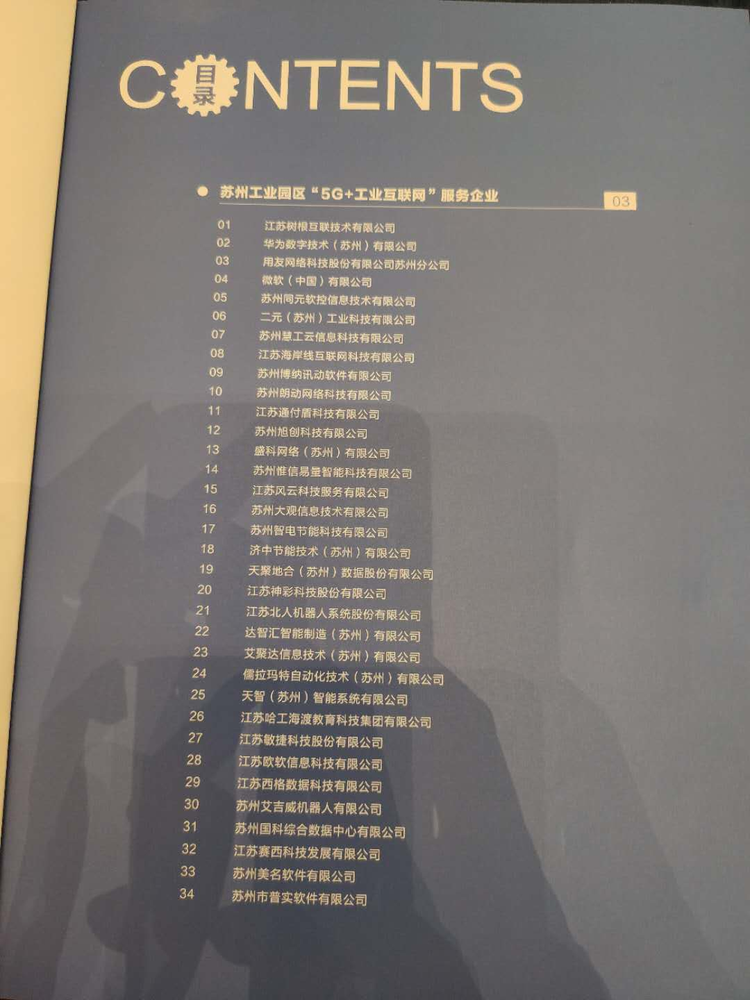
      * 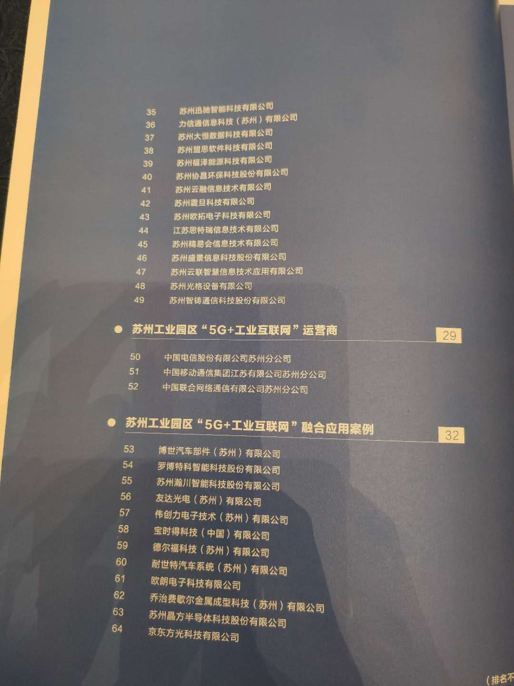
    * 平台类公司
      * 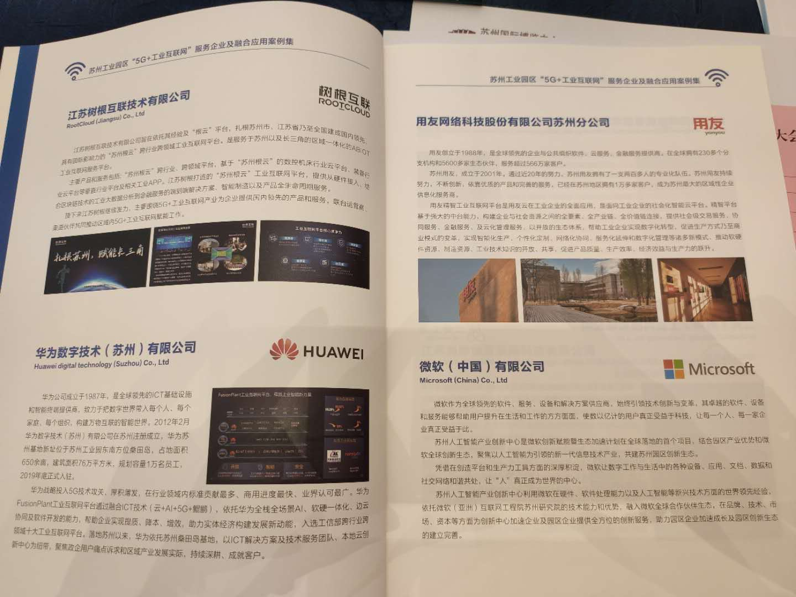
      * 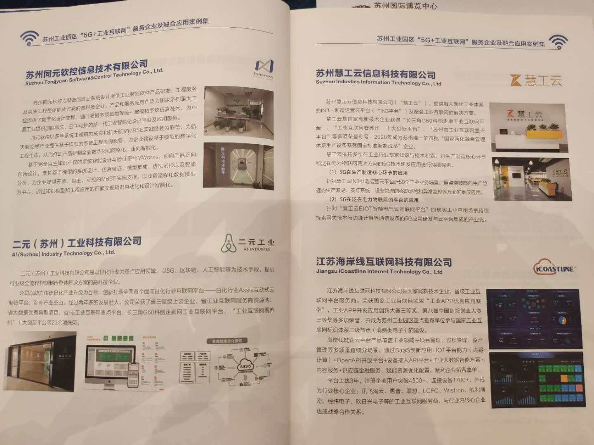
    * 工业相关公司
      * 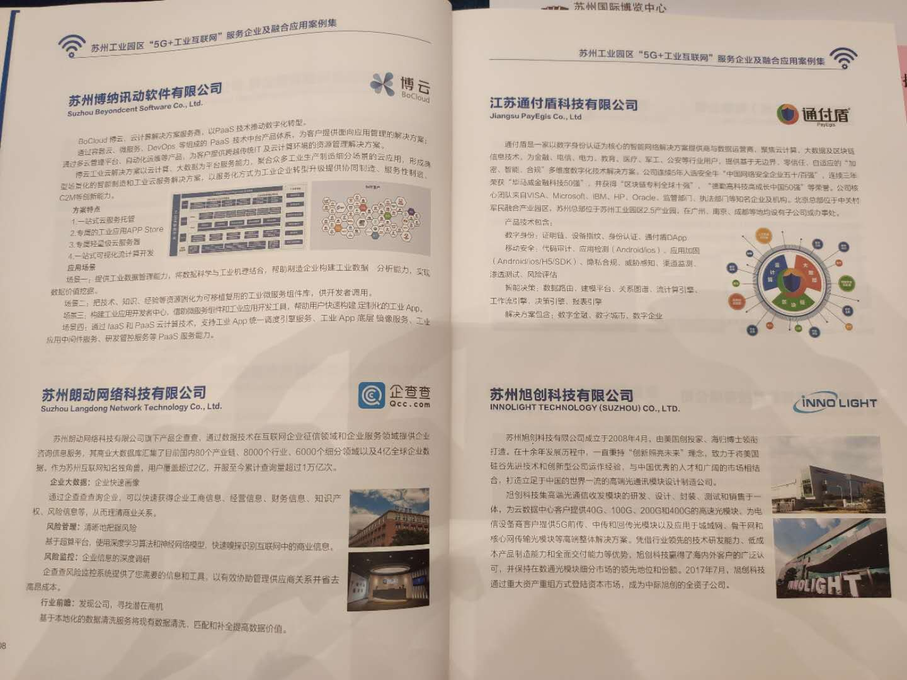
      * 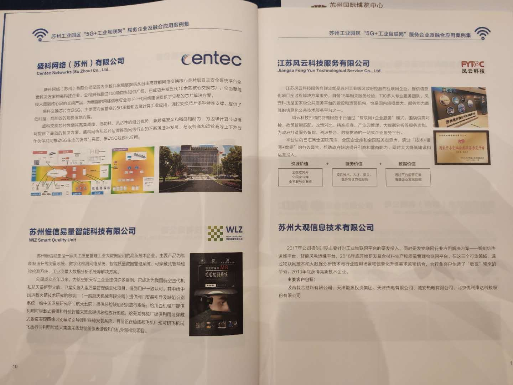
      * 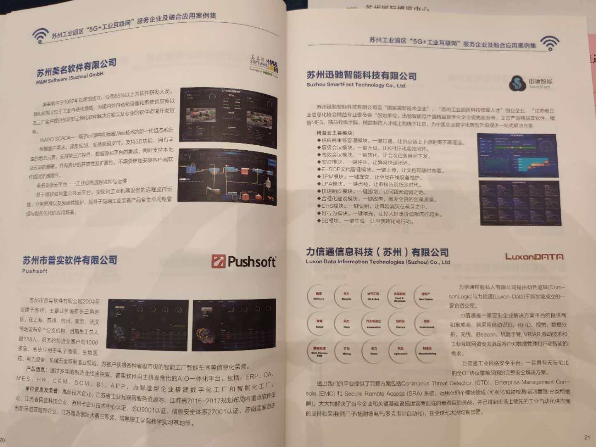
    * 三大运营商
      * 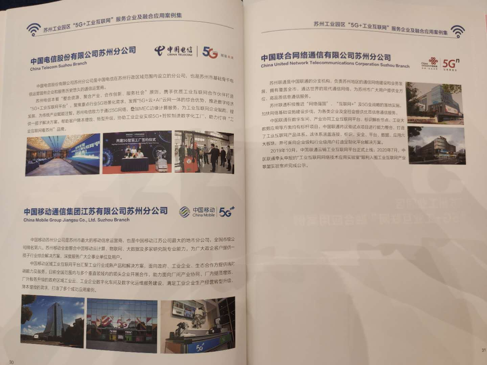
    * 具体应用案例
      * 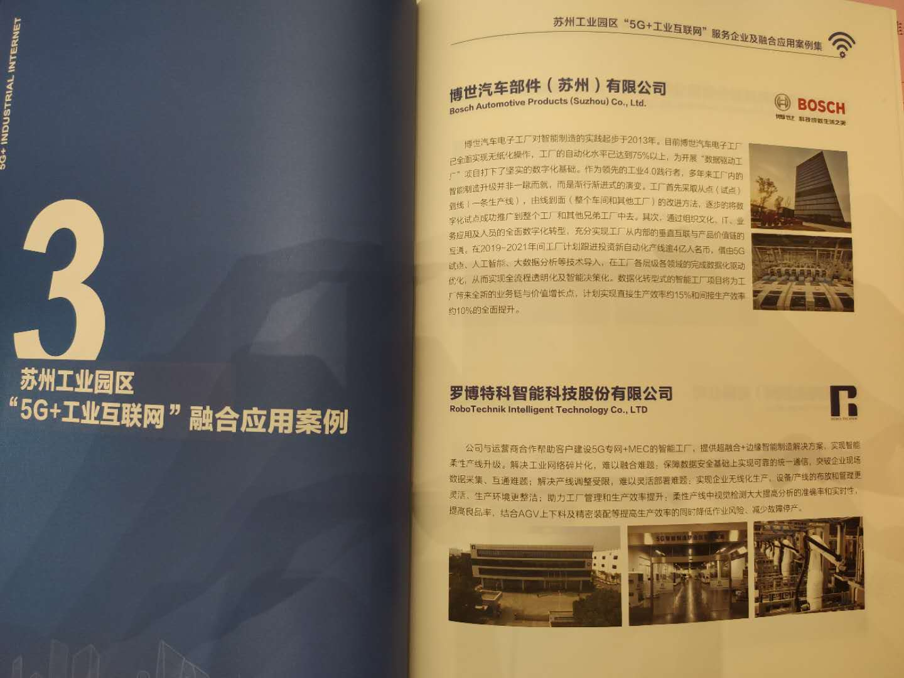
      * 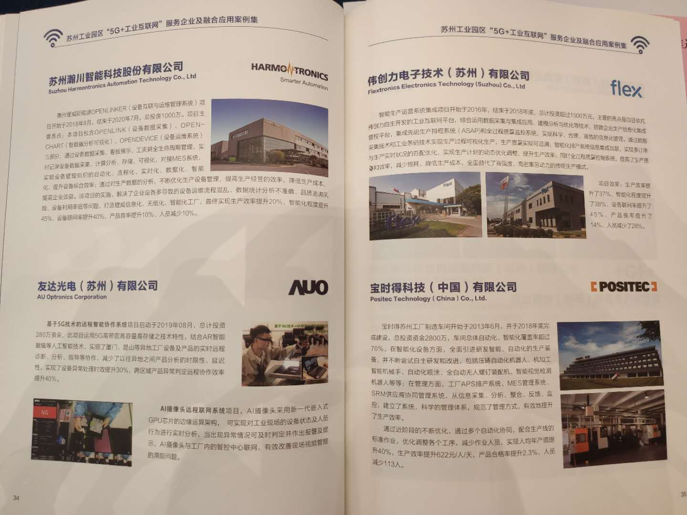
      * 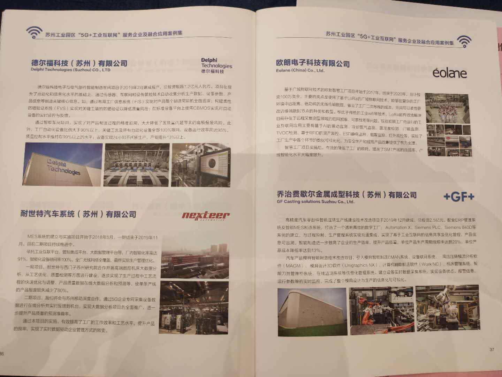
  * 热力图
    * “5G+工业互联网”融合应用热力图
      * http://sipjjsj.sipac.gov.cn/mobile/
        * 截图
          * 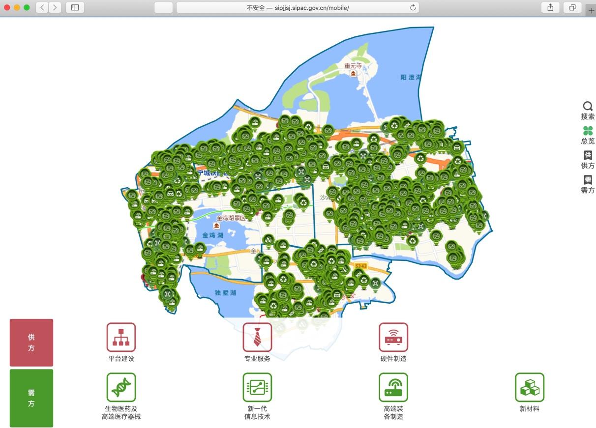
