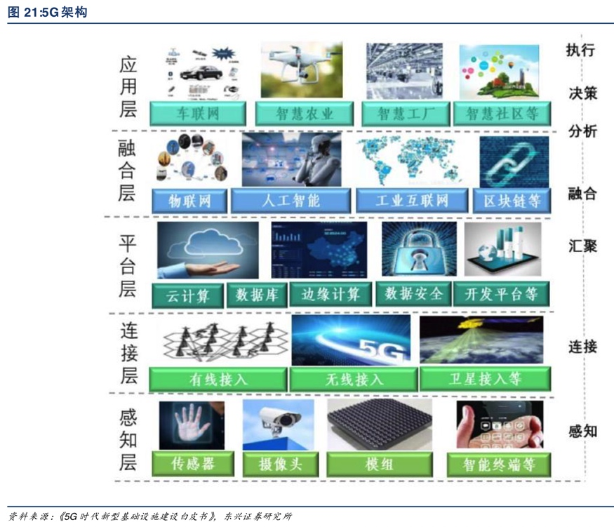
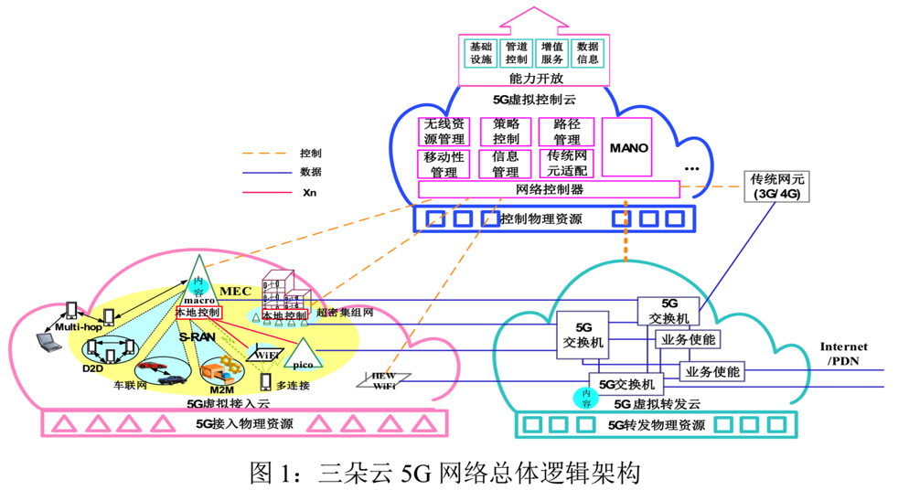
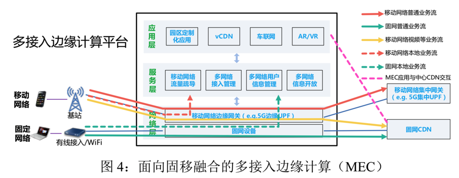
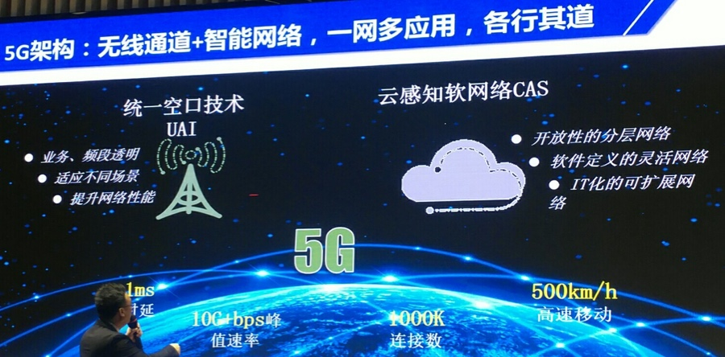
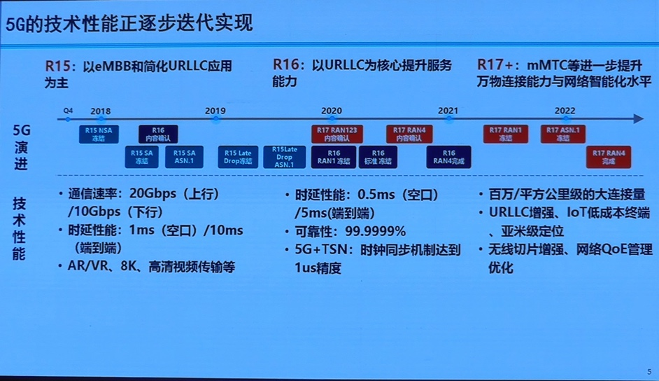
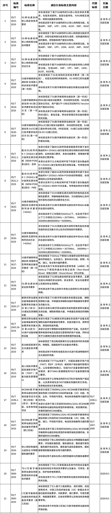
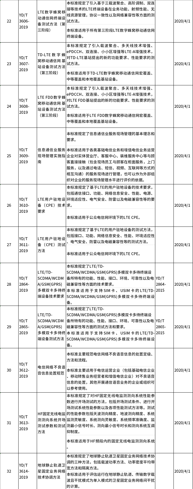

# 5G技术架构

* 5G技术架构
  * 应用分层
    * 
  * 网络总体架构
    * 三朵云
      * 
    * 面向固移融合的多接入边缘计算(MEC)
      * 
  * 无线通道+智能网络
    * 
      * 统一空口技术`UAI`
        * 业务频段透明
        * 适应不同场景
        * 提升网络性能
      * 云感知软网络`CAS`
        * 开放性的分层网络
        * 软件定义的灵活网络
        * IT化的可扩展网络

## 5G标准和性能

* 5G性能迭代实现
  * 

## 中国的5G

### 5G移动通信网 核心网总体技术要求

* 5G移动通信网 核心网总体技术要求
  * 规定了基于SA架构的5G核心网总体技术要求，包括
    * 系统架构
    * 高层功能特性
    * 与4G网络互操作
    * 网络功能服务架构
  * 本标准适用于基于SA架构的5GC核心网网络功能，包括
    * AMF
    * SMF
    * UPF
    * UDM
    * AUSF
    * NRF
    * NSSF
* 14项5G核心标准
  * 5G移动通信网核心网总体技术要求
  * 5G移动通信网核心网网络功能技术要求
  * 5G移动通信网核心网网络功能测试方法
  * 5G数字蜂窝移动通信网无线接入网总体技术要求(第一阶段)
  * 5G数字蜂窝移动通信网NG接口技术要求和测试方法(第一阶段)
  * 5G数字蜂窝移动通信网n/X2接口技术要求和测试方法(第一阶段)
  * 面向5G前传的 N×25Gbit/s 波分复用无源光网络(WDM-PON)第 1 部分：总体
  * 面向5G前传的 N×25Gbit/s 波分复用无源光网络(WDM-PON)第 2 部分：PMD
  * 5G数字蜂窝移动通信网无源天线阵列技术要求（<6GHz）
  * 5G数字蜂窝移动通信网无源天线阵列测试方法（<6GHz）
  * 5G 数字蜂窝移动通信网增强移动宽带终端设备技术要求(第一阶段)
  * 5G 移动通信网安全技术要求
  * 蜂窝式移动通信设备电磁兼容性能要求和测量方法第17部分：5G基站及辅助设备
  * 蜂窝式移动通信设备电磁兼容性能要求和测量方法第18部分：5G用户设备和辅助设备
* 5G相关通信行业标准
  * 
  * 
