# 5G和4G对比

* 相关背景知识
  * 从1G到5G
    * 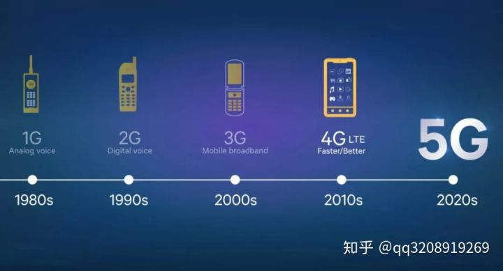
  * 移动通信架构
    * 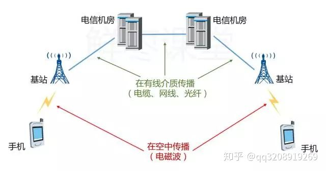
  * 频谱分布和用途
    * 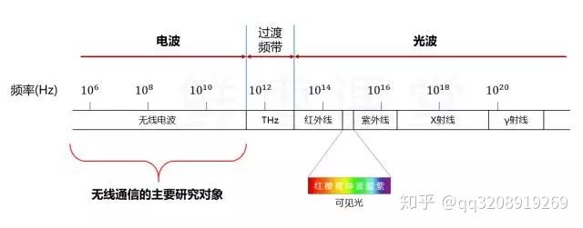
    * 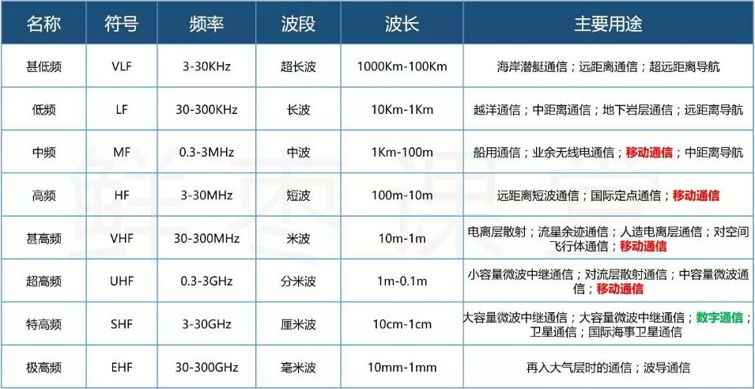
* 4G和5G的区别
  * 基站分布
    * 图
      * 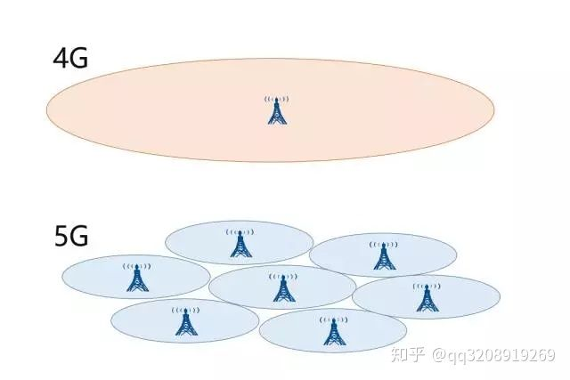
    * 文字
      * 4G
        * 宏基站
          * 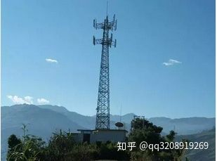
        * 用户体验
          * 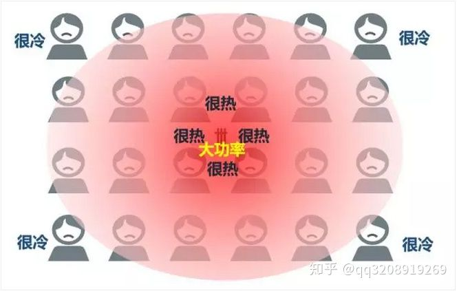
      * 5G
        * 微基站
          * 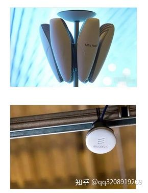
            * 举例
              * 中国移动
                * 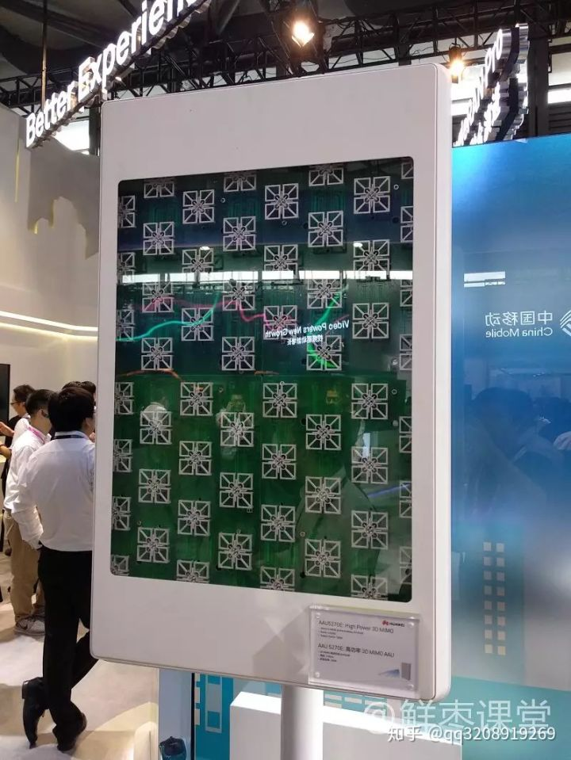
              * 中兴
                * 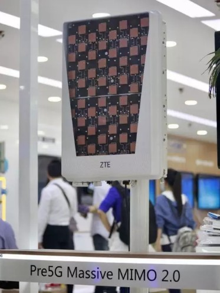
        * 用户体验
          * 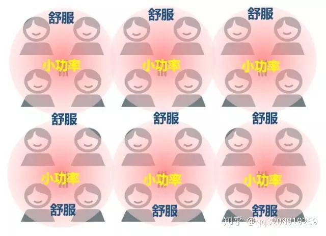
  * 频谱占用
    * 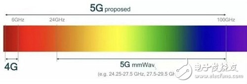
  * 手机天线对比
    * 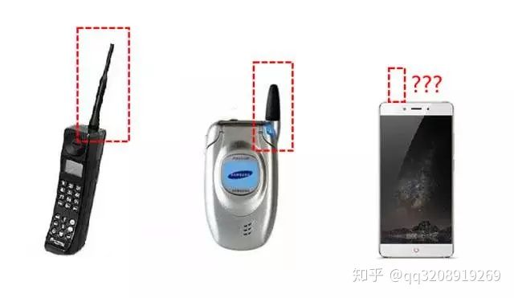
    * 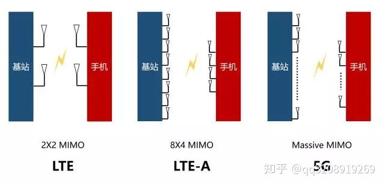
  * 5G时代，同一基站下的两个用户，如果互相进行通信，他们的数据将不再通过基站转发，而是直接手机到手机
    * 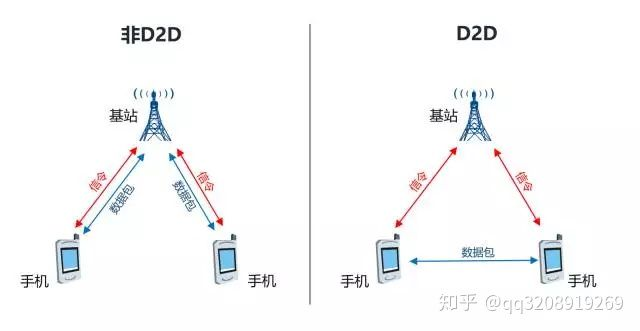
