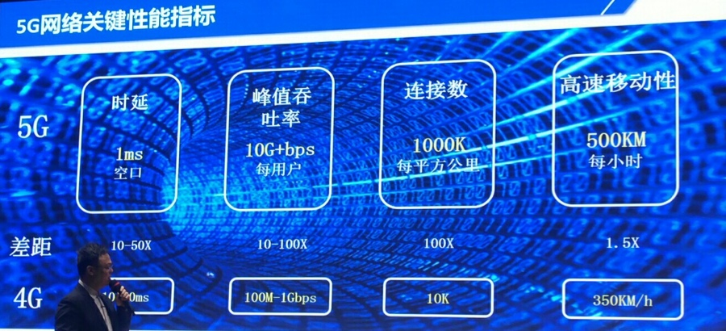
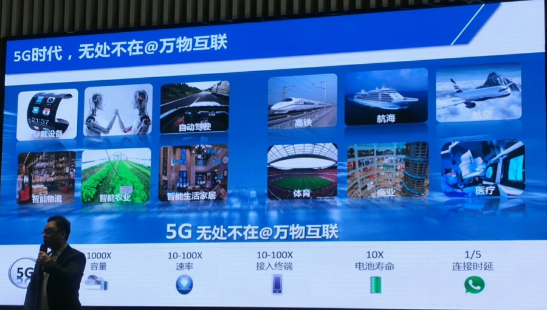
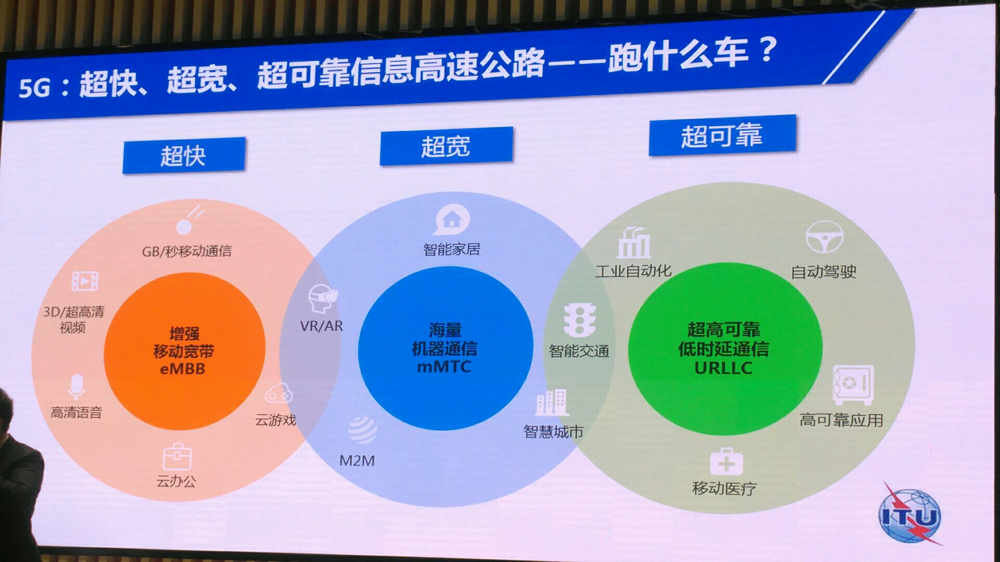
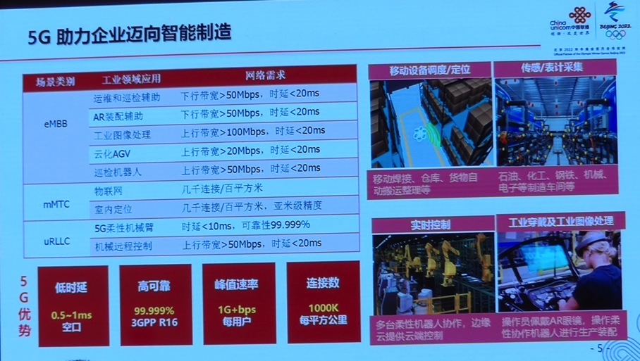
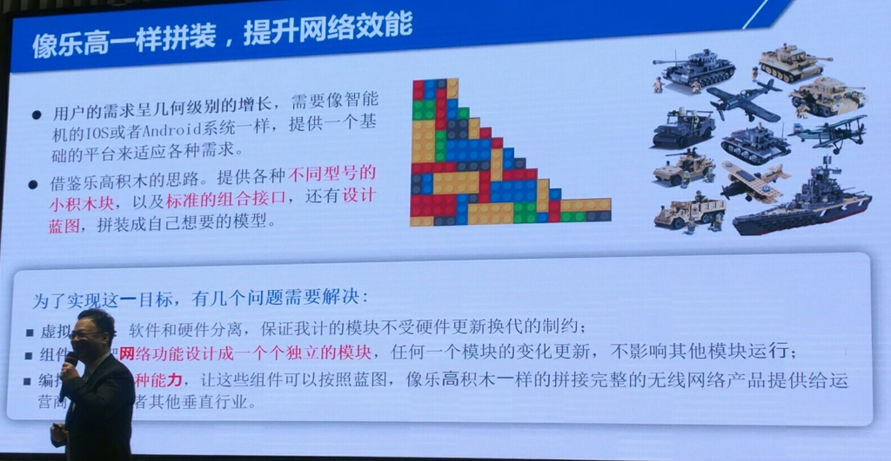
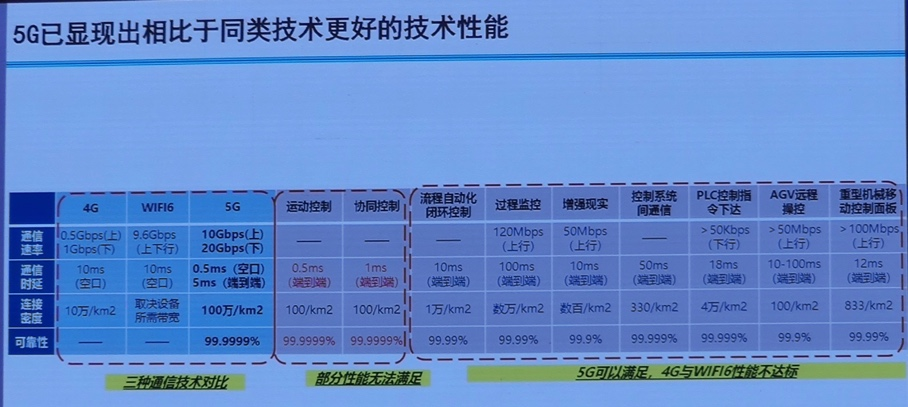

# 5G概述

## 5G是什么

* `5G`
  * `5G`=`第五代移动电话行动通信标准`
    * 也称：`第五代移动通信技术`
  * 是什么
    * 是`4G`之后的延伸
      * 对比
        * 5G vs 4G
          * 
    * 区别于2G/3G/4G
      * 5G
        * 不仅是
          * 移动通信技术的速度的提升
        * 而是
          * 多种无线接入技术演进集成后解决方案的总称
  * 具体表现
    * 图
      * 
    * 文字
      * 无处不在 且 万物互联
        * 每个东西都变成1个**SIM卡**
          * 都要交费
  * 核心参数
    * 1000x 倍容量
    * 10-100x 速率
    * 10-100x 接入终端
    * 10x 电池寿命
    * 1/5 连接延迟

## 5G特点

* 类比
  * 高速公路
    * 图
      * 
    * 文字
      * 高速公路=5G大带宽
      * 跑什么车=具体应用
* 特点 + 三大主要应用场景
  * `eMBB`=`增强型移动宽带`
    * 特点
      * 超快
        * 追求人与人的极致通信体验
    * 适合应用：对应于3D/超高清视频等大流量移动宽带业务
      * GB/秒移动通信
      * 3D和超高清视频
      * 高清语音
      * 云办公
      * 云游戏
  * `mMTC`=`海量机器通信`=`大规模物联网`
    * 特点
      * 超宽
        * 体现物与物的通信需求
    * 适合应用：应用于智慧城市、智能家居、可穿戴设备等以传感和数据采集为目标的场景
      * AR/VR
      * 智能家居
      * M2M
      * 智慧城市
  * `uRLLC`=`超高可靠低延迟通信`=`低时延高可靠通信`
    * 特点
      * 超可靠
    * 适合应用：面向如自动驾驶、移动医疗等对时延和可靠性要求极高的应用
      * 工业自动化
      * 智能交通
      * 自动驾驶
      * 高可靠应用
      * 移动医疗
* 特点 + 工业中的智能制造的应用
  * 
* 5G如何实现上述特点
  * 

## 5G技术优势

