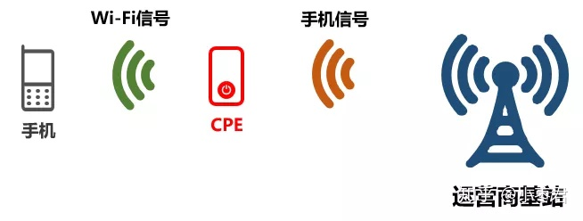
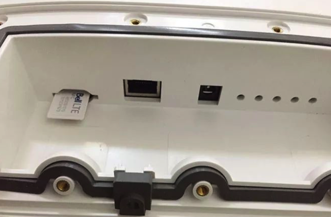
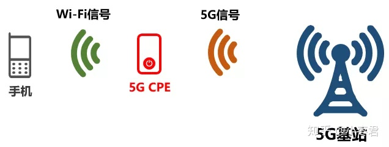
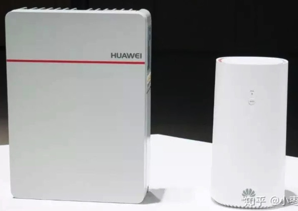
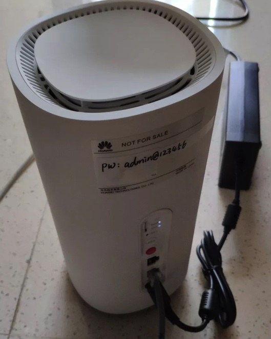

# CPE

* `CPE`=`Customer Premise Equipment`=`客户终端设备`
  * `Premise`：前提、假设
    * 感觉更准确的翻译为：`客户前置设备`
  * 作用：4G信号转Wi-Fi，并二次中继
    * 对手机信号（例如4G信号）进行二次中继。中继后，发出Wi-Fi信号
    * 把Wi-Fi信号进行二次中继，延长Wi-Fi的覆盖范围
      * 
  * 不同角度：
    * 对于基站：它就是一个手机
      * CPE可以插入SIM卡
        * 
  * 5G CPE
    * 支持5G网络的CPE，可以接收5G网络信号，并以此建立一个Wi-Fi网络
      * 
    * 产品举例
      * 
      * 
